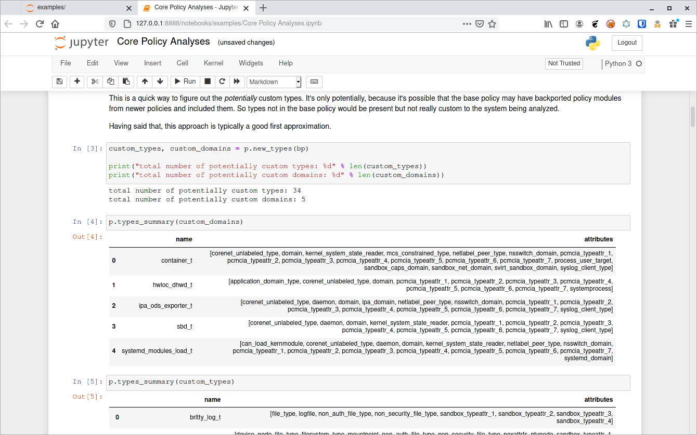

# Overview and Use

This is a Docker image to make using SELinux [SPAN](https://github.com/QuarkSecurity/SPAN) easier. You can use this with
the command:

    $ docker run -p 8888:8888 -v $(pwd):/home/span/SPAN/work bigbadwolfsecurity/span

This will run a Jupyter notebook with all of the SPAN requirements (including SETools) with the current
working directory mounted under work in the notebook. You can open one of the localhost links show in the console
in a web browser to view the notebook.

There is also the `span.sh` shell script that you can add to a directory in your `$PATH` that will start SPAN as above.

